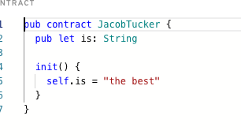
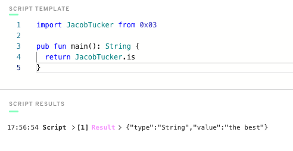
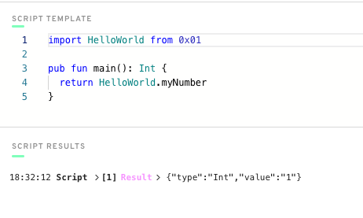
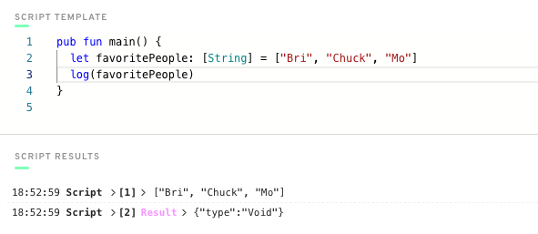

# quest-submissions


## Chapter 1 - Day 1

1. Explain what the Blockchain is in your own words.
    * A blockchain is a distributed public database and/or storage system depending on how you look at it. Because all of the data is replicated across every node (in most blockchain at least) in theory the data will always exist in an immutable state as long as one copy of the nodes exist. The data is typically stored in what is reffered to as the "ledger", this is what allows all the data to be publicly verfied by anyone. One of the main advantges to public blockchains is the ability for anyone to connect to the blockchain and execute transactions as long as they have a wallet and an internet connection. Blockchains use cryptography to not only verify you are authorized to make a certain transactions but also for securing the blockchain using either Proof of Work or Proof of Stake methods.

2. Explain what a Smart Contract is. 
    * A smart contract is a set of functions or variables stored on the blockchain that wallets can interact with. My favorite way to explain them is "Law as Code" taken from the wording in the Wyoming, USA DAO LLC laws. Since smart contracts are immutable on most blockchains they provide a transparent and trusted way for people and organizations to interact with each other..thus any code written becomes the law for all interactions good or bad.

3. Explain the difference between a script and a transaction.
    * Scripts are for reading the Flow blockchain while Transactions interact with it or "write" to it costing gas fees.
## Chapter 1 - Day 2

1. What are the 5 Cadence Programming Language Pillars?
    * Safety and Security, Clarity, Approachability, Developer Experience, Resource Oriented Programming
2. In your opinion, even without knowing anything about the Blockchain or coding, why could the 5 Pillars be useful (you don't have to answer this for #5)?
    1. Safety and Security
        * I think these are the cornerstone of every sucesffully blockchain (or at least they should be...). We need to ensure that any system we place our trust into is safe to operate with and is secure from both internal and external threats.
    2. Clarity
        * For me, clarity really builds on top of safety and security. As technology controls more and more of our lives we need to provide a way for people to understand what the code they are interacting with is doing. We see it all the time in scams from every industry that play on peoples lack of understanding to exploit them. Making the code easier to read is fundemental in helping people understand what the code is doing.
    3. Approachability
        * This one is a no brainer... unless the code is easier to learn, no one will take the time to learn it. If no one is developing on the platform user will leave it in favor of another platform that has projects or app the user is looking for... Yes I am looking at you Microsoft Phone...
    4. Developer Experience
        * This also builds upon Approachability. You need developers to like writing code for a paticular platform otherwise they simply won't do it
    5. Resource Oriented Programming
        * While not required I thought Resrouce Oriented Programming was an important item to cover. Many of the flaws in other blockchain's smart contracts is that they really where not built for the ownership of resources. There are many reason why the current structures don't work well but most all of them are there because they a shoe horned into a platform built to operate like one long accounting ledger. With Resource Oriented Programming we can finally start brining addtional industries into the Web3 space because of the security and overall data structures implemented that are not possible in other blockchains.
## Chapter 2 - Day 1

1. Deploy a contract to account 0x03 called "JacobTucker". Inside that contract, declare a constant variable named is, and make it have type String. Initialize it to "the best" when your contract gets deployed.
    * 
2. Check that your variable is actually equals "the best" by executing a script to read that variable. Include a screenshot of the output.
    * 
## Chapter 2 - Day 2

1. Explain why we wouldn't call changeGreeting in a script.
    * changeGreeting modifies a value on the blockchain requiring gas fees and is thus a transaction.
2. What does the AuthAccount mean in the prepare phase of the transaction?
    * The AuthAccount is the user or account that is paying for and signing the transaction to the blockchain
3. What is the difference between the prepare phase and the execute phase in the transaction?
    * The prepare phase is used to access the accounts storage and the underlying data, while the execution phase is used to call your functions that update the blockchain.
4. -
    1. Contract Changes
        * Add two new things inside your contract:
            * A variable named myNumber that has type Int (set it to 0 when the contract is deployed)
            * A function named updateMyNumber that takes in a new number named newNumber as a parameter that has type Int and updates myNumber to be newNumber
        * 
        ``` cadence
        pub contract HelloWorld {
            pub var greeting: String
            pub var myNumber: Int

            init() {
                self.greeting = "Hello World"
                self.myNumber = 0
            }

            pub fun changeGreeting(newGreeting: String) {
                self.greeting = newGreeting
            }

            pub fun updateMyNumber(newNumber: Int) {
                self.myNumber = newNumber
            }
        }
        ```
    2. Scripts
        * Add a script that reads myNumber from the contract

         ``` cadence
        import HelloWorld from 0x01

        pub fun main(): Int {
        return HelloWorld.myNumber
        }
        ```
    3. Transactions
        * Add a transaction that takes in a parameter named myNewNumber and passes it into the updateMyNumber function. Verify that your number changed by running the script again.

         ``` cadence
        import HelloWorld from 0x01

        transaction(myNewNumber: Int) {

            prepare(signer: AuthAccount) {}

            execute {
                HelloWorld.updateMyNumber(newNumber: myNewNumber)
            }
        }
        ```
        
    
## Chapter 2 - Day 3

1. In a script, initialize an array (that has length == 3) of your favourite people, represented as Strings, and log it.
    * 
2. In a script, initialize a dictionary that maps the Strings Facebook, Instagram, Twitter, YouTube, Reddit, and LinkedIn to a UInt64 that represents the order in which you use them from most to least. For example, YouTube --> 1, Reddit --> 2, etc. If you've never used one before, map it to 0!
    *
     ``` cadence
    pub fun main() {
        let socialUssage: {String: UInt64} = {"Facebook": 1, "Instagram": 0, "Twitter": 4, "Reddit": 2, "LinkedIn": 3}
    }
    ```
3. Explain what the force unwrap operator ! does, with an example different from the one I showed you (you can just change the type).
    * The ! force unwrap operator is used to forcably unwrap optional variables. Since the operation is forced it will fail or exit the code if the value is nil.
    ``` cadence
    pub fun main() {
        var int1: Int? = 1
        var unwrappedInt1: Int = int1!  

        var int2: Int? = nil
        var unwrappedInt2: Int = int2! 
    }
    ```
4. Image Explenation
    1. What the error message means
        * The error message states that it is expecting a string to be returns not an optional
    2. Why we're getting this error
        * The variable returned is a dictionary and dictonaries always return as an optional
    3. How to fix it
        * You could fix this by using ! to force unwrap the returned value or preferably change the return type to accept the optional and allow the error to be handled in the client.
## Chapter 2 - Day 4

1. Deploy a new contract that has a Struct of your choosing inside of it (must be different than Profile).
2. Create a dictionary or array that contains the Struct you defined.
3. Create a function to add to that array/dictionary.
``` cadence
pub contract Companies {
    pub var companies: {Address: Company}

    pub struct Company {
        pub let companyName: String
        pub let companyFormationDate: String
        pub let account: Address
        pub var employees: {Address: Employee}

        init(_companyName: String, _CompanyFormationDate: String, _account: Address) {
            self.companyName = _companyName
            self.companyFormationDate = _CompanyFormationDate
            self.account = _account
            self.employees = {}
        }

        pub fun addEmployee(firstName: String, lastName: String, birthday: String, account: Address) {
            let newEmployee = Employee(_firstName: firstName, _lastName: lastName, _birthday: birthday, _account: account)
            self.employees.insert(key: account, newEmployee)
        }
    }
    
    pub struct Employee {
        pub let firstName: String
        pub let lastName: String
        pub let birthday: String
        pub let account: Address

        init(_firstName: String, _lastName: String, _birthday: String, _account: Address) {
            self.firstName = _firstName
            self.lastName = _lastName
            self.birthday = _birthday
            self.account = _account
        }
    }

    pub fun addCompany(companyName: String, companyFormationDate: String, account: Address) {
        let newCompany = Company(_companyName: companyName, _CompanyFormationDate: companyFormationDate, _account: account)
        self.companies.insert(key: account, newCompany)
    }

    init() {
        self.companies = {}
    }
}
```
4. Add a transaction to call that function in step 3.
    *
    ``` cadence
    import Companies from 0x01

    transaction(companyName: String, companyFormationDate: String, companyAccount: Address, firstName: String,lastName: String, birthday: String, employeeAccont: Address) {

        prepare(acct: AuthAccount) {}

        execute {
            Companies.addCompany(companyName: companyName, companyFormationDate: companyFormationDate, account: companyAccount)

            Companies.companies[companyAccount]!.addEmployee(firstName: firstName, lastName: lastName, birthday: birthday, account: employeeAccont)
        }
    }
    ```
5. Add a script to read the Struct you defined.
    *
    ``` cadence
    import Companies from 0x01

    pub fun main(account: Address): Companies.Company {
    return Companies.companies[account]!
    }
    ```
